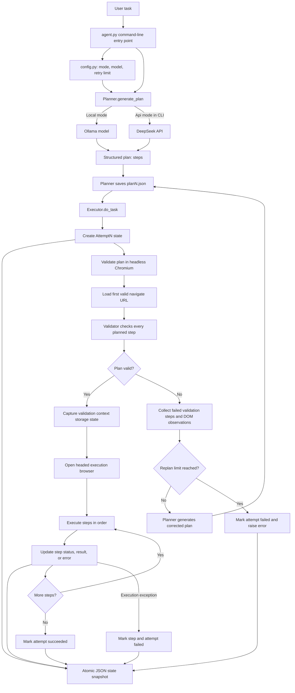

# Browser Automation Agent(WIP)

An LLM-driven browser automation prototype. It accepts a natural-language task, asks a language model to produce a structured action plan, checks that plan against a browser page, and executes it with Playwright when validation succeeds. Invalid plans are sent back through a bounded validation-and-replanning loop.

The current implementation is browser-first. Direct service API execution, automatic clarification, and resuming a prior run from its saved state are not implemented.

## Architecture and Flow



### Run lifecycle

1. `agent.py` validates the task argument and selects the configured model mode.
2. `Planner` creates a JSON-compatible plan and saves it in `saved_plan/`.
3. `Executor` creates an `Attempt1` state record and starts validation.
4. The validator checks each step against the page loaded at the plan's first valid `navigate` URL. It does not execute earlier actions to simulate later page states.
5. If validation fails, the executor records the validation results, gathers observations for failed target roles, and asks the planner for a corrected plan. This repeats up to `MAX_REPLAN_ATTEMPTS` times.
6. If validation succeeds, the executor transfers the validation context's storage state to a new, headed browser context and executes the plan.
7. The state snapshot is rewritten after lifecycle transitions and each execution-step transition. Exceptions are recorded before they are raised to the caller.

## Project Structure

```text
.
|-- agent.py                    # CLI and top-level planning/execution orchestration
|-- config.py                   # Model mode, names, paths, and replan limit
|-- Planner/
|   `-- planner.py              # Prompt construction, model calls, and plan saving
|-- Executor/
|   `-- action.py               # Validation/replanning loop and Playwright execution
|-- Validator/
|   `-- validate.py             # URL, action, target, and wait validation
|-- tools/
|   |-- dom_observation.py      # DOM observations for failed target roles
|   |-- download.py             # Direct file-response downloader
|   |-- extractor.py            # Structured page-data and product-listing extraction
|   `-- load_json.py            # JSON file/string loading helpers
|-- state/
|   |-- agent_state.py          # Atomic JSON state writer
|   `-- agent_state.json        # Latest run snapshot (created at runtime, ignored by Git)
|-- saved_plan/                 # Generated plans and replans
|-- traces/                     # Browser screenshots and other run artifacts
|-- testing/                    # Manual Playwright exploration script
|-- free_memory/                # Standalone process/VRAM cleanup helpers
|-- requirements.txt            # Core Python dependencies
`-- .env.example                # Names of optional model API credentials
```

## Components

### `agent.py`: application entry point

`run(task)` rejects an empty task, constructs a planner, generates the initial plan, then creates a Playwright session and passes the plan and original task to the executor. Run the project through this file for the complete workflow.

The CLI accepts the task as positional text, so quote it when it contains shell-special characters. Use `-m/--mode` to choose `Local` (default) or `Api`; the `Api` branch selects DeepSeek and the `Local` branch uses the configured Ollama model.

### `Planner/planner.py`: plan generation

`Planner.generate_plan()` assembles the initial-task or replan prompt, calls the configured model, and parses/saves the model's structured JSON plan. Plans use a top-level `steps` array. Supported action names are `navigate`, `download`, `click`, `fill`, `press`, `select`, `wait`, and `extract`.

Initial plans are saved as `saved_plan/planN.json`; replans are saved with a `replanN.json` name in `saved_plan/`. The planner supports an Ollama streaming path and HTTP API request paths. In the current CLI configuration, API mode chooses DeepSeek; other provider code is not exposed as a CLI option.

For `extract`, the prompt asks the model for an output `category` and the exact requested `fields`, without CSS selectors or DOM details. Product-listing extracts also receive a `query` naming the specific product/model and are asked for `product_name`, `price`, `currency`, `retailer`, and `product_url`, preferring Flipkart for current Indian prices. The replan prompt additionally forbids repeating extraction on a page that requested human verification and forbids attempting to solve it.

### `Executor/action.py`: orchestration and browser actions

`Executor.do_task()` creates numbered attempt records, validates the plan, requests replans when validation fails, and executes a plan only after it passes validation. `validate_plan()` launches headless Chromium. A valid plan is then executed in a separate headed Chromium context using the validation context's storage state.

Execution dispatches each plan step to the corresponding Playwright operation. Direct file downloads use `tools/download.py` and are saved under `downloads/`; the saved path is stored as the step result. `get_target_locator()` resolves semantic targets through the validator. `extract` steps call `tools/extractor.py` to pull structured data (for example product listings or publication metadata) and store it as the step result; extraction raises an error when the page requests human verification or requested fields are missing, which feeds back into replanning. For India-market product lookups (`MARKET == "IN"`), `_route_product_search()` rewrites the navigation step to a Flipkart search or a DuckDuckGo/Bing/Brave search source. Screenshots are written under `traces/` (`opened.png` and `action.png`).

### `Validator/validate.py`: pre-execution guardrail

`Validater` checks the plan structure and supported action type. Navigation and download actions require an HTTP or HTTPS URL with a host; the download helper checks the response status and rejects HTML responses during execution. `extract` actions require a non-empty `category` string and a non-empty list of non-empty `fields`. Target actions require a semantic target with a non-empty role and name. The resolved candidate is checked for visibility and the action-specific property, such as enabled, editable, keyboard-capable, selectable, or readable.

Per-step validation records include the step number, action, role, rule description, and boolean validity. Structural errors are reported at plan level; target-check exceptions are collected in the validation result. Validation is a preflight check, not a replay or simulation of the action sequence.

### `tools/dom_observation.py`: failed-target context

When validation fails, `find_relevant_element()` opens a separate headless browser at the current URL, inspects elements matching the failed role, and returns properties such as tag, name, placeholder, visibility, enabled state, and editability. This data is supplied to the planner for replanning; it does not execute a plan action.

### `tools/extractor.py`: structured page-data extraction

`extract_categorized(page, category, fields, query)` runs in-page JavaScript to collect structured data. For product categories it scans links whose text carries a currency/price pattern (₹, `Rs`, `$`, `€`, `£`) and returns `product_name`, `price`, `currency`, `retailer`, and `product_url` items (unwrapping DuckDuckGo redirect URLs). For general categories it resolves requested fields through JSON-LD, `<meta>` tags, and semantic elements (`dt`/`dd`, `th`/`td`, `<label>`, `<time>`), with alias groups for titles, authors, abstracts, publication dates, and PDF URLs. It also detects human-verification prompts (CAPTCHA / "not a robot") and reports them in a `blocked` field without attempting to solve them.

### `state/agent_state.py`: durable run snapshot

`save_agent_state()` serializes the in-memory state as formatted JSON. It writes a temporary file in the destination directory and uses `os.replace()` to replace the snapshot atomically. The default output is `state/agent_state.json`.

The executor keeps one top-level `AttemptN` entry per validation/replan attempt. An attempt contains the task, plan, validation report, execution-step records, status, and any error or replan details. The file represents the latest run; starting another run replaces the previous snapshot. It is not currently a resume/recovery mechanism.

Example shape (values abbreviated):

```json
{
    "task": "Search Wikipedia for Python tutorials",
    "Attempt1": {
        "attempt": 1,
        "replan_attempt": 0,
        "status": "replanned",
        "plan": {"steps": []},
        "validation": {"valid": false, "steps": []},
        "execution": {"current_step": null, "steps": []},
        "replan": {"status": "succeeded", "next_attempt": 2, "plan": {"steps": []}}
    },
    "Attempt2": {
        "attempt": 2,
        "replan_attempt": 1,
        "status": "succeeded",
        "validation": {"valid": true, "steps": []},
        "execution": {"current_step": null, "steps": []},
        "error": null
    }
}
```

Attempt keys are one-based (`Attempt1`, `Attempt2`); `replan_attempt` is zero-based. Validation failures live under `validation`; runtime action failures live on the corresponding item in `execution.steps` and on the attempt's error fields.

### Supporting modules

- `config.py` defines `MODE`, `MARKET`, model names, `MAX_REPLAN_ATTEMPTS`, `MAX_PLANNER_RETRIES`, plan paths, and the replan instruction. The default mode is `Local`.
- `tools/load_json.py` provides helpers to load JSON from a file or string.
- `tools/download.py` fetches a direct file URL through the current Playwright page's request context, derives a safe filename, and returns the saved path.
- `tools/extractor.py` extracts structured page data and product listings, and flags pages that request human verification without attempting to solve it.
- `testing/testing.py` is a manual Playwright locator exploration script, not an automated regression test suite.
- `free_memory/free_Mmemory.py` provides a process RSS / glibc memory-trim helper. `free_memory/free_vram.py` contains a PyTorch CUDA cache helper. Neither is called by the main agent flow.
- `saved_plan/` contains sample plans and generated plans. `traces/` receives screenshots and is intended for run artifacts.

## Plan Format

Each plan has a `steps` list. For example:

```json
{
    "steps": [
        {"action": "navigate", "url": "https://www.wikipedia.org"},
        {
            "action": "fill",
            "target": {"role": "textbox", "name": "Search Wikipedia"},
            "value": "Python tutorials"
        },
        {
            "action": "press",
            "target": {"role": "textbox", "name": "Search Wikipedia"},
            "key": "Enter"
        }
    ]
}
```

Target actions use Playwright semantic roles and accessible names, not planner-invented CSS selectors. Action-specific fields are:

| Action | Required fields |
| --- | --- |
| `navigate` | `url` |
| `download` | `url` for a direct file response |
| `click` | `target` |
| `fill` | `target`, `value` |
| `press` | `target`, `key` |
| `select` | `target`, `value` |
| `extract` | `category`, `fields` (and optional `query` for product listings) |
| `wait` | `duration` for the currently implemented executor |

An `extract` step's execution result is an object with `category`, `data`, `missing_fields`, and `blocked`. Example:

```json
{
    "action": "extract",
    "category": "product_listing",
    "query": "RTX 4050 laptop",
    "fields": ["product_name", "price", "currency", "retailer", "product_url"]
}
```

## Setup

Requirements: Python 3.10 or newer, Chromium for Playwright, and either an API credential or a running Ollama installation, depending on the selected mode.

```bash
python -m venv .venv
source .venv/bin/activate
python -m pip install -r requirements.txt
playwright install chromium
```

For API mode, copy `.env.example` to `.env` and set `DEEPSEEK_API` to your API key. Keep `.env` private and do not commit credentials.

For local mode (the default), install and start Ollama and pull the configured model:

```bash
ollama pull qwen3.5:4b
```

`MODE` is set in `config.py` (default `Local`) and can be overridden per run with the `-m/--mode` flag, for example `python agent.py -m Api "..."`. The project loads `.env` in the planner module.

## Running

Run a natural-language task through planning, validation, execution, and optional replanning:

```bash
python agent.py "Search Wikipedia for Python tutorials"
```

Plans are executed through `agent.py`. The executor no longer exposes a standalone command-line entry point, so `python Executor/action.py` is not a run path; `PLAN_PATH` remains defined in `config.py` for reference.

Generated plans/replans are saved to `saved_plan/`. The latest task state is written to `state/agent_state.json`. Downloads are saved to `downloads/`, and screenshots are written to `traces/`.

## Configuration

| Setting | Purpose |
| --- | --- |
| `MODE` | `Api` or `Local`; set in `config.py` or overridden with `-m/--mode` (defaults to `Local`) |
| `MODEL_NAME` | Ollama model used in local mode |
| `DEEPSEEK_MODEL` | Model name used by the CLI API path |
| `MAX_TOKEN` | API generation token limit |
| `MAX_REPLAN_ATTEMPTS` | Maximum number of replans after the initial plan |
| `MAX_PLANNER_RETRIES` | Maximum retries the planner makes for an invalid model response |
| `MARKET` | Target market for product searches; `"IN"` enables India-specific product routing |
| `PLAN_PATH` | Saved plan path defined in config (no standalone executor entry point) |

## Current Limitations

- The validator loads the first valid navigation URL and checks planned targets against that page. It does not simulate clicks, form submissions, or page transitions before checking later steps.
- The executor only supports duration-based waits. Although the validator accepts a wait condition, condition-based execution raises `NotImplementedError`.
- Pre-execution validation failures and direct-download or extraction execution failures can trigger bounded replanning. Other execution-time failures are saved in state and raised.
- A task that explicitly asks to download cannot be marked successful unless its plan contains a download action and execution saves the response successfully.
- A `download` action requires a direct file URL. Finding a file by title on a website and navigating through search results is not yet reliable because validation does not simulate earlier page actions.
- Product extraction relies on detecting currency/price patterns in link text, so results depend on page markup and may miss listings that do not render prices in link text.
- When a page requests human verification, extraction reports it in the `blocked` field and fails the step; the agent does not attempt to solve verification, and replanning is expected to switch to a different source host.
- India-market product routing (`MARKET == "IN"`) rewrites navigation only for `extract` steps whose `category` contains "product"; other markets and non-product extracts keep the planner's original navigation.
- `collect_replan_data()` currently reports no successfully executed steps because replanning is initiated before plan execution.
- Direct API actions, API-first routing, human clarification, and automatic state-based resume are not implemented.
- The state file is a single latest-run snapshot and may contain task text, plan inputs, or extracted content. Protect it if those values are sensitive.
- `free_memory/` helpers are optional utilities and require packages/platform features that are not listed as core dependencies in `requirements.txt`.

## Troubleshooting

- **Chromium executable missing:** run `playwright install chromium` in the active Python environment.
- **API request rejected:** check that `.env` contains a valid `DEEPSEEK_API` key and that `MODE` is `Api`.
- **Local model unavailable:** start Ollama and confirm the model in `MODEL_NAME` has been pulled.
- **Plan target fails validation:** confirm the page URL and accessible role/name in the plan match the page that validation opens.
- **Attempt ended in `failed`:** inspect `state/agent_state.json` for the failed stage, validation report, and execution-step error.
- **Extraction reports `blocked`:** the page requested human verification and the agent will not solve it; rerun so replanning can switch to a different source, or confirm the target site is reachable without a challenge.
